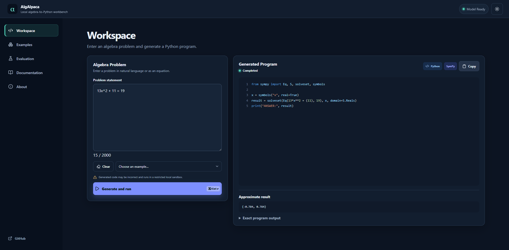

# AlgAlpaca

[](https://github.com/bhkaushik14/AlgAlpaca/actions/workflows/ci.yml)

AlgAlpaca is a local algebra-to-Python/SymPy research workbench built around a QLoRA adapter for Code Llama 7B. It generates a complete program, applies syntax and AST policy checks, runs accepted code in a restricted local subprocess, and displays the program and result.

## Demo



*A real local run of the current application. V2 generated and executed a SymPy program for the entered quadratic equation; this is a recorded local demo, not a hosted service.*

## Key results

On the frozen custom 100-problem benchmark, automated correctness progressed from **17/100 → 39/100 → 59/100** for the base model, original adapter, and v2 adapter.

| Condition | Automated correct | Executable output |
|---|---:|---:|
| Base model | 17/100 | 38/100 |
| Original adapter | 39/100 | 61/100 |
| V2 adapter | **59/100** | **85/100** |

The 59/100 result is the primary automated comparison. A separate manual mathematical review accepted 12 additional equivalent v2 outputs rejected by the frozen scorer, producing a reviewed total of 71/100; 71/100 is not the automated benchmark score. Executable output improved from 61/100 for the original adapter to 85/100 for v2.

The adapter is not included in this repository. It must be supplied from an authorized private local copy and used with `codellama/CodeLlama-7b-Instruct-hf` revision `22cb240e0292b0b5ab4c17ccd97aa3a2f799cbed`.

## System

```text
problem → frozen prompt → local model generation → code extraction
        → syntax and policy checks → restricted subprocess → displayed result
```

- Accepts an algebra problem in the browser.
- Generates a Python/SymPy program with the locally configured adapter.
- Extracts code, validates syntax, and applies an AST-based execution policy.
- Runs accepted code in a restricted subprocess with time and resource limits.
- Displays the generated program and result, including concise failure details.

The React workspace communicates with a local FastAPI service. Model loading remains lazy, and the generated-code execution controls are intended for a single-user local application rather than anonymous public traffic. See the detailed [architecture](docs/architecture.md), [evaluation methodology](evaluation/README.md), and [model card](MODEL_CARD.md).

## Training and evaluation scope

V2 was produced by continuing QLoRA fine-tuning from the original adapter rather than training a fresh adapter from the base model.

| Preserved second-stage fact | Value |
|---|---:|
| Execution-verified examples | 16,500 across 22 algebra categories |
| Training split | 13,186 |
| Validation split | 1,677 |
| Held-out dataset test split | 1,637 |
| Final continuation training | 1 epoch, 825 optimizer steps |

The 1,637-example held-out dataset split and the frozen 100-problem confirmatory benchmark are different evaluation sets. The custom benchmark does not measure general mathematical ability, and the preserved public artifacts do not establish exhaustive semantic non-overlap between every benchmark problem and every generated training example. The repository also does not contain everything required to reproduce the complete training run from scratch; see [history](docs/history.md) and [limitations](docs/limitations.md).

## Quick start

AlgAlpaca supports Python 3.10 and 3.11. Use an existing compatible PyTorch/CUDA setup when possible; creating a fresh environment does not guarantee GPU compatibility.

```bash
python3 -m venv .venv
source .venv/bin/activate
python -m pip install -e ".[web]"
cd frontend
npm ci
npm run build
cd ..
cp .algalpaca-adapter-path.example .algalpaca-adapter-path
```

Edit `.algalpaca-adapter-path` to contain the absolute path to the authorized local v2 adapter directory. This ignored file tells the app where to find the adapter; the runtime still requires the fixed v2 sizes, hashes, and PEFT configuration. The private weights remain outside Git and must be supplied locally.

The required Code Llama base revision must be locally available or downloadable by an authorized user. With an already populated cache, optional offline execution can use `HF_HUB_OFFLINE=1`.

PyTorch and CUDA installation is machine-specific; this repository does not replace either. Then check and launch:

```bash
./run-algalpaca --check
./run-algalpaca
```

Open `http://127.0.0.1:8000`. The check command validates local configuration without loading or calling the model.

## Repository map

- `src/codellama_algebra/`: inference, extraction, policy, execution, scoring, and API code.
- `frontend/`: React/TypeScript interface.
- `demo/`: local Gradio fallback and illustrative cases.
- `tests/`: functional application and evaluation tests.
- `evaluation/`: frozen fixture, retained base/original results, v2 per-case results, methodology, comparison, and offline validators.
- `docs/`: architecture, history, limitations, licensing, and provenance notes.
- `release/huggingface/`: applicable license and third-party notices retained for the private adapter.

## Limitations

V2 automated correctness is 59/100, not 71/100; the larger number includes clear manual equivalence judgments. Seven policy failures, eight execution failures, and fourteen remaining mathematical errors show that generated programs still require review. The execution controls reduce risk but are not hardened for public multi-user arbitrary-code execution. See [limitations](docs/limitations.md).

## History

The original adapter and experiments predate this public repository. V2 is a second-stage continuation from that adapter, while the repository remains the home of the local application and compact evaluation package. Some original training details remain incomplete; see [history](docs/history.md).

## Links

- [AlgAlpaca on GitHub](https://github.com/bhkaushik14/AlgAlpaca)
- [Evaluation methodology and results](evaluation/README.md)
- [Three-model comparison](evaluation/comparison.md)
- [V2 per-case results](evaluation/v2_case_results.csv)
- [Model card](MODEL_CARD.md)
- [Licensing](docs/licensing.md)
